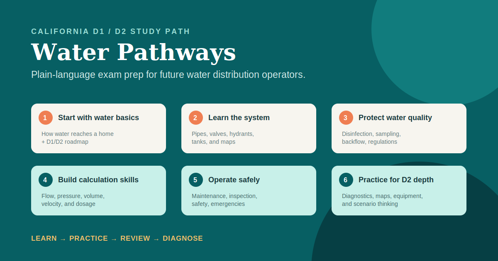

# Water Pathways

> A beginner-friendly study app for California Water Distribution Operator D1 and D2 exam preparation.



Water Pathways helps a person with no water-utility background understand how drinking-water distribution systems work before asking them to solve a problem or answer an exam-style question. It combines everyday analogies, fictional field scenarios, step-by-step calculations, immediate quiz feedback, and a sourced guide to the California certification process.

## Who it is for

- People exploring a first career in drinking-water distribution
- Entry-level utility staff preparing for California D1
- D1 candidates building toward D2
- Learners who want explanations in plain language before industry terminology

## What learners can do today

| Area | What the app includes |
| --- | --- |
| Guided learning | Beginner lessons that move from a home faucet back through pipes, storage, pumps, and the water source. |
| Learn → quiz loop | Short lessons use an analogy, a visual, a field anecdote, then a low-pressure knowledge check with explanations. |
| Adaptive review | Browser-local progress records missed objectives and identifies topics that need review. |
| Formula reference | A readable formula sheet plus live calculators for pipe capacity, flow/velocity, pressure/head/force, and chemical feed. |
| Exam guide | Eligibility, fees, application links, computer-based test scheduling, category allocation, and study recommendations. |
| Study library | Links to supplementary video lessons, AWWA, CA-NV AWWA, Sacramento State, and State Board reading materials. |

## Learning path

1. **Water systems for beginners** — how water gets to a home and what D1/D2 certification means.
2. **System fundamentals** — storage, mains, valves, hydrants, meters, and service connections.
3. **Water quality and disinfection** — residuals, sampling, backflow, contaminants, and regulations.
4. **Hydraulics and calculations** — volume, flow, velocity, pressure, head, dosage, and water hammer.
5. **Operations and safety** — equipment, inspection, maintenance, emergency response, and field safety.
6. **D2 readiness** — maps, D2-level applications, diagnostics, and targeted weak-area review.

## California D1/D2 exam snapshot

The State Board’s published knowledge outline allocates **100 questions** to both D1 and D2 exams. The app presents this blueprint in its Exam section and is designed to grow into a 350–500-question original practice bank.

| Official category | D1 questions | D2 questions | Planned original question bank |
| --- | ---: | ---: | ---: |
| Disinfection | 15 | 20 | 60–80 |
| Distribution system design / hydraulics | 20 | 20 | 70–90 |
| Equipment operation / maintenance / inspections | 20 | 20 | 70–90 |
| Regulations / management / safety | 15 | 10 | 55–75 |
| Water mains and piping | 20 | 20 | 60–80 |
| Water quality / water source | 10 | 10 | 40–60 |
| **Total official exam** | **100** | **100** | **350–500 planned** |

The current MVP contains **10 original starter questions**. This is intentionally transparent: the interaction model is complete, while the content bank is actively being expanded objective by objective. A release is not considered comprehensive until every official D1/D2 objective has a lesson, a worked example or field scenario, and multiple original questions.

### How tests are scheduled

D1/D2 exams are computer based. Once an application is approved, candidates receive a **90-day window** to schedule with Prometric; available dates, times, and testing-center locations depend on live Prometric availability. This repository does not publish fixed appointment dates because they change. [Read the State Board’s computer-based testing FAQ](https://water.waterboards.ca.gov/water_issues/programs/operator_certification/docs/cbt_faqs.pdf).

### Scoring and readiness

The State Board provides a pass/fail result after its computer-based exam and does not publish a fixed passing-question count. Inside Water Pathways, the suggested readiness threshold is 80% in every category and 90% on calculations before treating a diagnostic as a strong readiness signal.

## Official and supplementary resources

Certification rules, fee schedules, application forms, and test availability can change. The State Water Board is the source of truth.

- [California Drinking Water Operator Certification Program](https://water.waterboards.ca.gov/drinking_water/certlic/occupations/DWopcert.html)
- [Expected Range of Knowledge for Distribution Exams](https://water.waterboards.ca.gov/drinking_water/certlic/occupations/documents/opcert/2016/dist_range_of_know.pdf)
- [D1/D2 distribution minimum qualifications](https://water.waterboards.ca.gov/drinking_water/certlic/occupations/documents/opcert/distribution_qualifications.pdf)
- [Official recommended distribution reading material](https://www.waterboards.ca.gov/drinking_water/certlic/occupations/documents/opcert/recommended_reading_material_dist.pdf)
- [AWWA operator resources](https://www.awwa.org/operators/)
- [California-Nevada AWWA education](https://ca-nv-awwa.org/education/)
- [Sacramento State Office of Water Programs](https://www.owp.csus.edu/courses/drinking-water.php)
- [The Water Sifu video lessons](https://www.thewatersifu.com/youtube/)

**Last source review:** July 18, 2026. Always verify requirements, fees, forms, and appointment availability with the State Board before acting.

## Technology

- Next.js + TypeScript
- Responsive CSS interface
- Browser-local progress storage; no account or learner data is collected in the MVP
- Vitest for calculation utilities

## Run locally

```bash
npm install
npm run dev
```

Open [http://localhost:3000](http://localhost:3000). To run checks:

```bash
npm test
npm run build
```

## Roadmap

- [x] Beginner learning interface and initial lesson-to-quiz flow
- [x] Calculator, glossary, diagnostic, application guide, and Exam Blueprint
- [x] Original visual learning map and sourced study-resource library
- [ ] Map every State Board D1/D2 objective to an original lesson and question bank
- [ ] Expand from 10 starter questions to 350–500 original questions
- [ ] Add question-bank coverage tests and subject-matter-expert review workflow
- [ ] Add timed practice-exam mode, account sync, and Spanish support

## Important notice

Water Pathways is an independent study aid. It is not an accredited course, official State Board application, certification provider, or a guarantee of passing an exam. Field anecdotes are fictional teaching scenarios.
